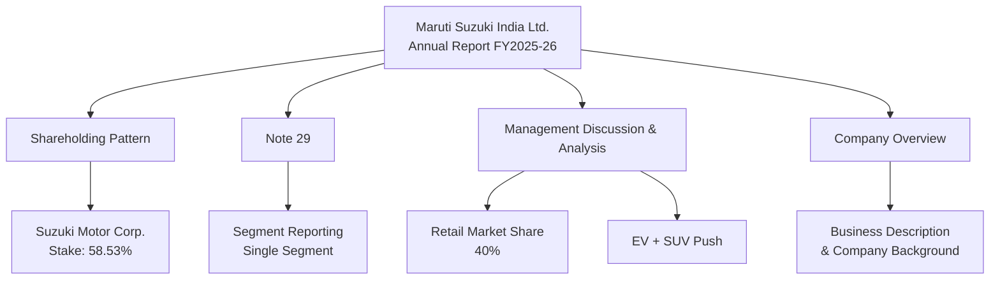

Maruti Suzuki India Ltd. is majority-owned by its Japanese parent, Suzuki Motor Corporation, which held a 58.53% stake as of March 31, 2026, up from 58.28% a year earlier. The company operates as a single reportable segment — its Board, acting as the Chief Operating Decision Maker, evaluates performance as one unit with no separate segment reporting, per Note 29 of the FY26 standalone financial statements.

In FY 2025-26, Maruti's retail market share in the domestic passenger vehicle industry was approximately 40%, per the company's own MD&A disclosure. It holds a leadership position across most product segments but remains a close challenger in the fast-growing SUV segment and has not yet achieved leadership in this category.

Strategically, the company follows a multi-powertrain approach rather than betting solely on EVs. Alongside petrol, CNG, and hybrid options, it launched its first battery-electric SUV, the e VITARA, in FY26, while continuing to push new SUV models such as the Victoris to close its share gap in the category.

## Source Log

| Data Point | Value | Source Location |
|---|---|---|
| Suzuki Motor Corp. stake | 58.53% (Mar 31, 2026); 58.28% (Mar 31, 2025) | Shareholding Pattern table, Notes to Standalone Financial Statements, MSIL Annual Integrated Report 2025-26 |
| Segment reporting | Single reportable segment | Note 29, "Segment Reporting," Standalone Financial Statements, MSIL AIR 2025-26 |
| Retail market share | ~40% (FY 2025-26) | Management Discussion & Analysis, MSIL AIR 2025-26 (company's internal estimate, not SIAM-audited) |
| SUV segment share | Leadership "within close reach," not yet achieved | MD&A, MSIL AIR 2025-26 |
| EV / strategy | e VITARA (first BEV SUV) launched FY26; multi-powertrain strategy | MD&A, "Defining the Future of Mobility" section, MSIL AIR 2025-26 |

